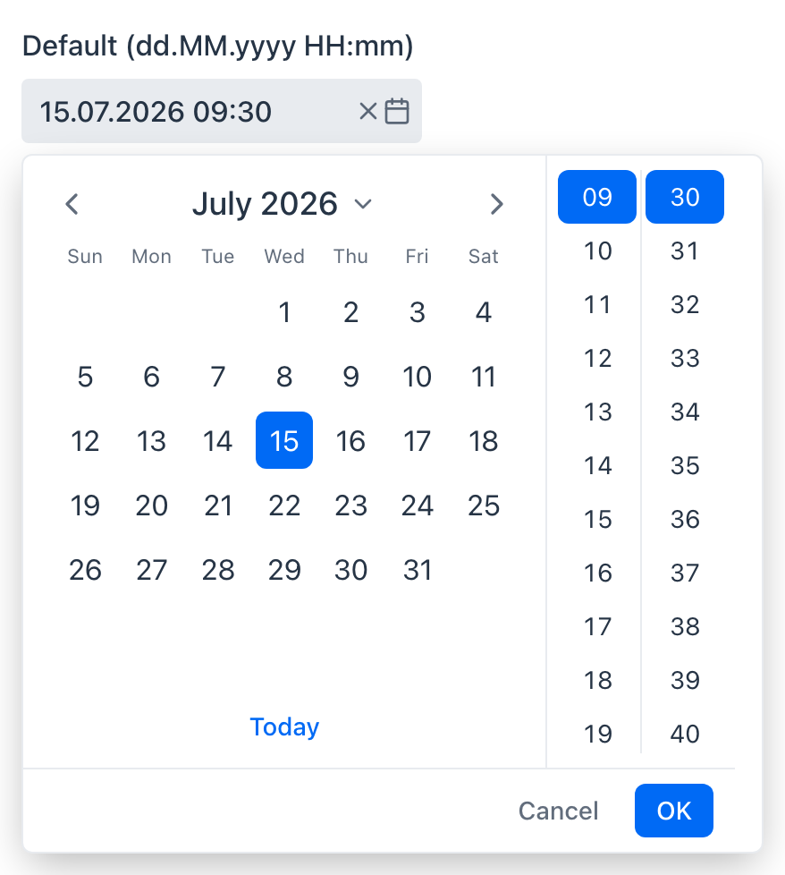
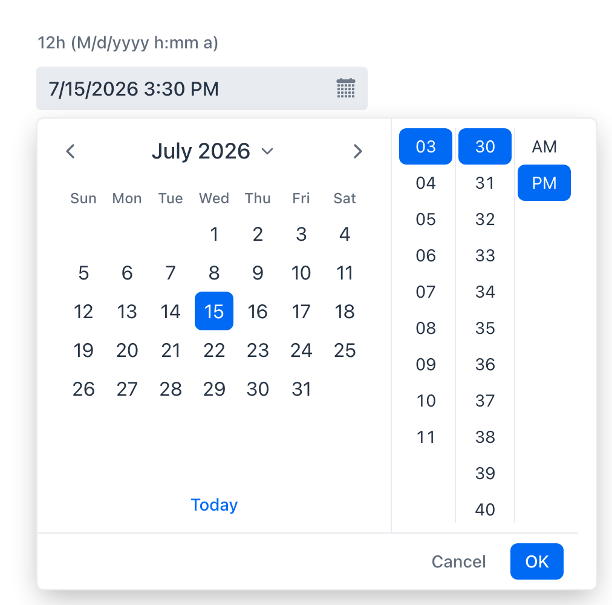
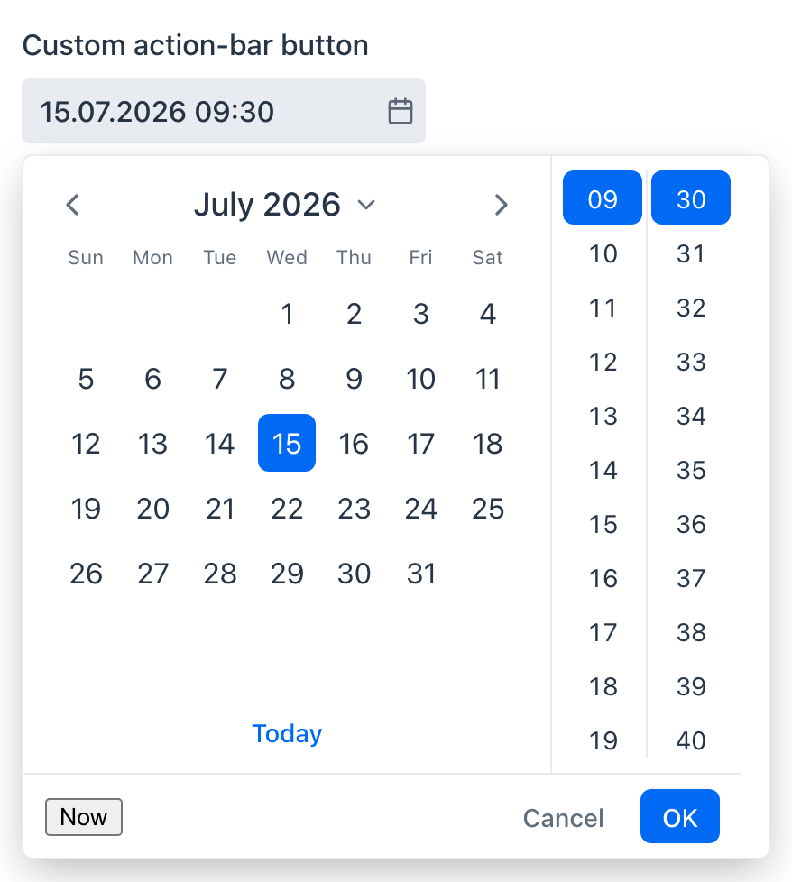
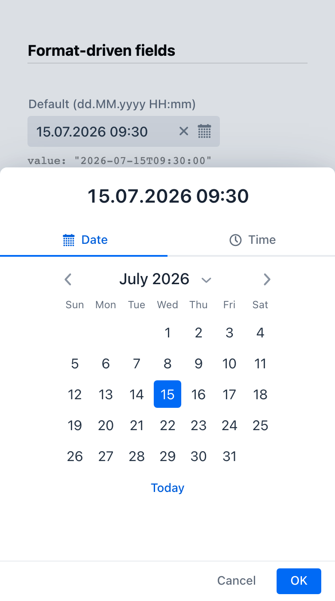
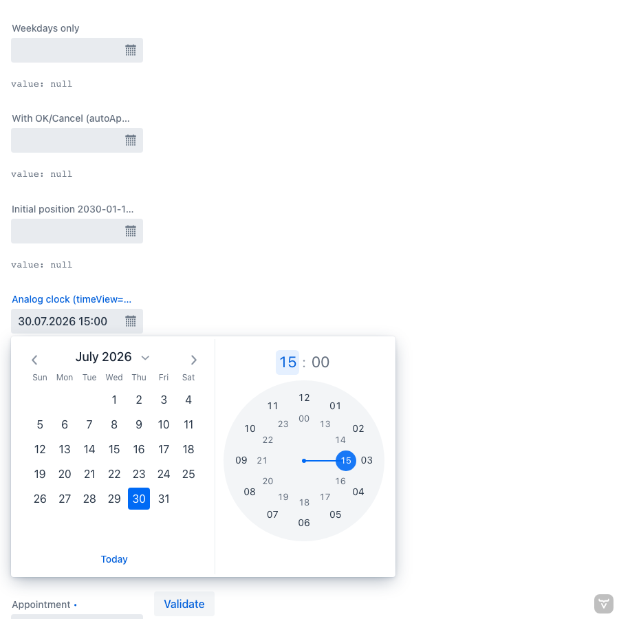

# DateTimeComboPicker

A combined **date & time picker**: a single field with a `LocalDateTime` value and a
**single popup** containing a month calendar and sliding time columns side by side.

The **date-time format pattern drives the UI**: the pattern defines how the value is
displayed and parsed in the field, *and* which time parts are offered in the popup —
no `ss` in the pattern → no seconds column, no `mm` → no minutes column,
`h`/`hh` → 12-hour clock with an AM/PM column.

| Default (24h) | 12h with AM/PM |
| --- | --- |
|  |  |

| OK/Cancel action bar | Mobile bottom sheet | Analog clock |
| --- | --- | --- |
|  |  |  |

This is a mono-repo with two packages:

| Package | Artifact | For |
| --- | --- | --- |
| [`web-component/`](web-component) | npm `date-time-combo-picker` | Any web app (Lit-based web component) |
| [`flow/`](flow) | Maven `org.vaadin.addons:datetimecombopicker` | Vaadin Flow 24.4+ (Java 17) |

## Vaadin Flow usage

```xml
<dependency>
    <groupId>org.vaadin.addons</groupId>
    <artifactId>datetimecombopicker</artifactId>
    <version>1.0.0</version>
</dependency>
```

```java
DateTimeComboPicker picker = new DateTimeComboPicker("Meeting");
picker.setFormat("dd.MM.yyyy HH:mm:ss");   // seconds column appears automatically
picker.setValue(LocalDateTime.now());
picker.setMin(LocalDateTime.of(2026, 1, 1, 0, 0));
picker.setClearButtonVisible(true);
picker.addValueChangeListener(e -> System.out.println(e.getValue()));
```

Works with `Binder` out of the box (`HasValue<..., LocalDateTime>`), supports label,
helper, placeholder, tooltip, error message / invalid state, required indicator,
min/max, auto-open, week numbers and i18n. Further options:

```java
picker.setMinuteStep(5);                    // minutes column: 00, 05, ... 55
picker.setSecondStep(30);                   // seconds column: 00, 30
picker.setInitialPosition(                  // popup position & defaults when empty
        LocalDateTime.of(2030, 1, 15, 12, 30));
picker.setAutoApply(false);                 // stage selections behind an OK/Cancel bar
picker.setDateDisabledFunction(             // disable dates client-side (0-based month!)
        "(d) => [0, 6].includes(new Date(d.year, d.month, d.day).getDay())");
picker.setTimeView(TimeView.CLOCK);         // analog clock dial instead of columns
```

On viewports smaller than 450px the popup becomes a fullscreen bottom sheet with a
backdrop, and the time columns stack below the calendar.

I18n example:

```java
picker.setI18n(new DateTimeComboPickerI18n()
        .setMonthNames(List.of("tammikuu", "helmikuu", /* ... */ "joulukuu"))
        .setFirstDayOfWeek(1)
        .setToday("Tänään"));
```

## Web component usage

```sh
npm install date-time-combo-picker
```

```html
<script type="module">
  import 'date-time-combo-picker/dist/date-time-combo-picker-lumo.js';
</script>

<date-time-combo-picker
  label="Meeting"
  format="M/d/yyyy h:mm a"
  value="2026-07-30T13:30:00"
></date-time-combo-picker>
```

The `value` property/attribute is an ISO-8601 local date-time string
(`yyyy-MM-ddTHH:mm:ss`), empty string when unset. Events: `value-changed`,
`opened-changed`, `invalid-changed`, `change`.

## Format pattern

Supported pattern letters (a subset of `java.time` / `SimpleDateFormat`):

| Letters | Meaning | Effect on popup |
| --- | --- | --- |
| `yyyy` / `yy` | year (4-digit / 2-digit, windowed 1950–2049) | calendar shown |
| `MM` / `M` | month | calendar shown |
| `dd` / `d` | day of month | calendar shown |
| `HH` / `H` | hour 0–23 | 24h hours column |
| `hh` / `h` | hour 1–12 | 12h hours column + AM/PM column |
| `mm` / `m` | minute | minutes column |
| `ss` / `s` | second | seconds column |
| `a` | AM/PM marker | — |

Anything else is a literal; quote literal text with single quotes (`'at'`).
A pattern with only date letters behaves like a date picker (popup closes on
selection); a pattern with only time letters shows only the time columns.

Examples: `dd.MM.yyyy HH:mm` (default), `dd.MM.yyyy HH:mm:ss`, `M/d/yyyy h:mm a`,
`dd.MM.yyyy HH`, `yyyy-MM-dd`, `HH:mm:ss`.

## API overview

| Java (Flow) | Element property / attribute | Description |
| --- | --- | --- |
| `setValue(LocalDateTime)` | `value` | The selected date-time (element: ISO-8601 string, `''` when empty) |
| `setFormat(String)` | `format` | Pattern driving display, parsing and which time parts are shown |
| `setMin(LocalDateTime)` / `setMax(...)` | `min` / `max` | Allowed range; out-of-range values are invalid |
| `setTimeView(TimeView)` | `time-view` | `COLUMNS` (default) or `CLOCK` (analog dial) |
| `setHourStep(int)` / `setMinuteStep(int)` / `setSecondStep(int)` | `hour-step` / `minute-step` / `second-step` | Interval between selectable time values |
| `setDateDisabledFunction(String)` | `isDateDisabled` (function property) | Disables individual dates; disabled dates fail validation |
| `setInitialPosition(LocalDateTime)` | `initial-position` | Popup position and date/time defaults while the field is empty |
| `setAutoApply(boolean)` | `auto-apply` | `false` stages selections behind an OK/Cancel action bar |
| `setOpened(boolean)` | `opened` | Opens/closes the popup |
| `setAutoOpen(boolean)` | `auto-open-disabled` (inverted) | Whether the popup opens on field interaction |
| `setShowWeekNumbers(boolean)` | `show-week-numbers` | ISO week numbers (requires first day of week = Monday) |
| `setClearButtonVisible(boolean)` | `clear-button-visible` | Clear button in the field |
| `setI18n(DateTimeComboPickerI18n)` | `i18n` | Month/weekday names, button labels, first day of week |
| `setLabel`, `setPlaceholder`, `setHelperText`, `setErrorMessage`, `setRequiredIndicatorVisible`, `setEnabled`, `setReadOnly`, `setTooltipText` | standard field properties | Inherited Vaadin field API; works with `Binder` |

Events: `value-changed`, `opened-changed`, `invalid-changed`, `change`
(Flow: `addValueChangeListener`). Full reference in the
[element JSDoc](web-component/src/date-time-combo-picker.ts) and the Javadoc.

## Development

```sh
# Web component: dev playground, tests, build
cd web-component
npm install
npm run dev        # vite playground at http://localhost:5173
npm test           # web-test-runner (real Chromium)
npm run build      # tsc -> dist/

# Flow add-on: demo app + tests
cd flow
mvn jetty:run      # demo at http://localhost:8080 (builds the npm package first)
mvn test
mvn install -Pdirectory   # build the Vaadin Directory zip (target/*.zip)

# Integration tests: drive the demo app in Chromium (starts jetty automatically)
cd it
npm install
npm test           # VAADIN_VERSION=24.10.8 npm test to run against another platform
```

CI (GitHub Actions) runs the web-component tests, `mvn verify` against the minimum
(24.4) and latest supported Vaadin platform, and the Playwright integration tests.

The Flow jar bundles the compiled web component under `META-INF/frontend`, so the
add-on has no npm-publication dependency; bare imports (`lit`, `@vaadin/*`) resolve
against the consuming application's Vaadin 24 platform packages.

## Architecture notes

- The month calendar is **forked from `@vaadin/date-picker`**
  ([vaadin/web-components](https://github.com/vaadin/web-components) v24.8.14,
  Apache-2.0) rather than imported from its private internals, so Vaadin minor
  updates cannot break it. See [`NOTICE`](NOTICE) for provenance and the list of
  forked files.
- The popup is composed from the public `@vaadin/overlay` mixins, the field chrome
  from `@vaadin/field-base` — the same recipe Vaadin's own pickers use, so the
  component inherits Lumo theming and form-field behavior.
- The time selector is a set of free-scrolling digital-clock columns with
  click-to-select and keyboard support (`ArrowUp`/`ArrowDown`/`Home`/`End`).
  Alternatively, `time-view="clock"` renders an analog dial in the Material
  Design (Android) time-picker style: tap or drag to pick, double ring for 24h,
  digital readout to switch between hour/minute/second views, `role="slider"`
  keyboard support, and automatic view advancement.
- **Calendar keyboard navigation**: `ArrowDown` in the field moves focus into the
  calendar; arrows move by day/week, `PageUp`/`PageDown` by month
  (`Shift` for year), `Home`/`End` to first/last day of the month,
  `Enter`/`Space` selects, `Escape` closes and returns focus to the field.
- **Year navigation**: clicking the month-year header opens a scrollable year
  grid (1900–2099).

## Inspirations & credits

This project stands on the shoulders of:

- [vcf-date-time-range-picker](https://github.com/vaadin-component-factory/vcf-date-time-range-picker)
  (Vaadin Component Factory) — proved the "fork the date-picker and graft a time UI
  into the same popup" approach.
- [Vaadin DateTimePicker](https://vaadin.com/docs/latest/components/date-time-picker)
  — the API model (`LocalDateTime` value, ISO string element property, min/max,
  i18n object). DateTimeComboPicker exists because DateTimePicker uses two separate
  fields and overlays where one combined popup was wanted.
- [Material Design date & time pickers](https://m3.material.io/components/time-pickers/overview)
  — the popup layout (calendar beside sliding hour/minute/second columns) and the
  analog clock dial with automatic view advancement.
- [MiniCalendar add-on](https://vaadin.com/directory/component/minicalendar-add-on-for-vaadin)
  — evaluated as the calendar building block; not used because it is a server-side
  Java component and this add-on needed a client-side calendar inside a single
  web-component popup.
- [@vaadin/date-picker](https://github.com/vaadin/web-components/tree/main/packages/date-picker)
  (Apache-2.0) — the forked month-calendar implementation and the Lumo theme CSS it
  ships with; also the reference for field/overlay composition.
- [addon-starter-flow](https://github.com/vaadin/addon-starter-flow) — Maven
  conventions for Vaadin Directory add-ons (test-scope demo, directory assembly).

## License

Apache License 2.0. See [LICENSE](LICENSE) and [NOTICE](NOTICE).
